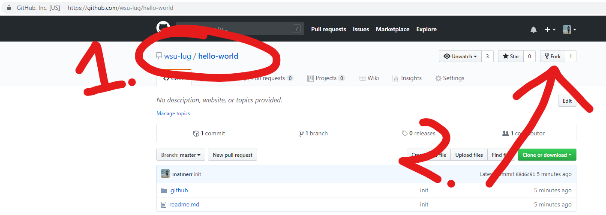
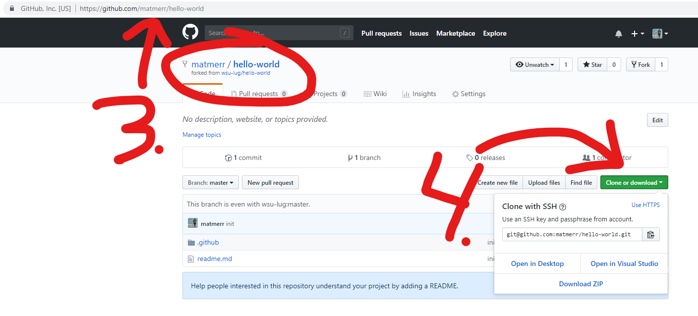
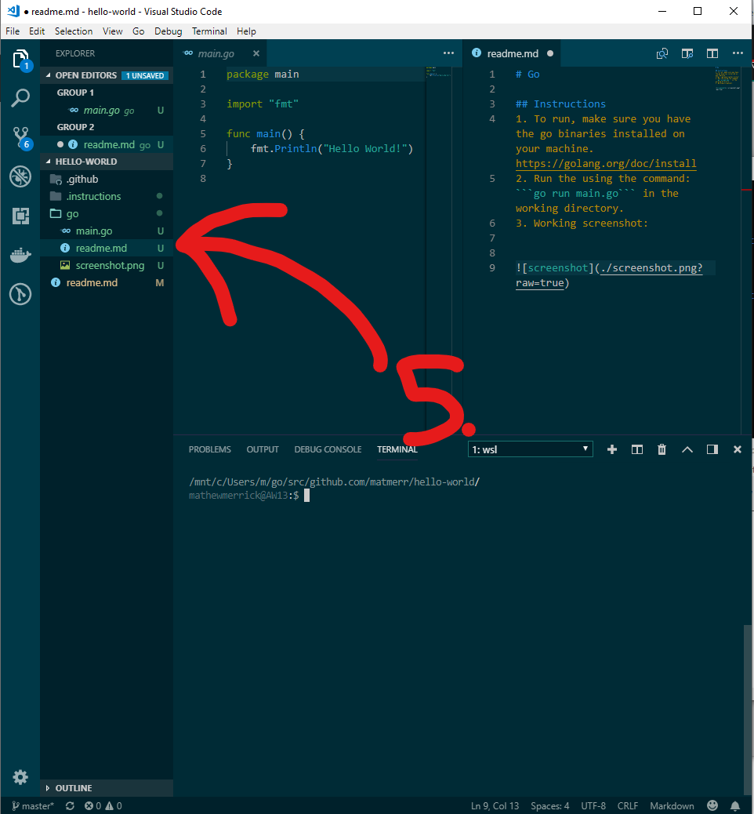
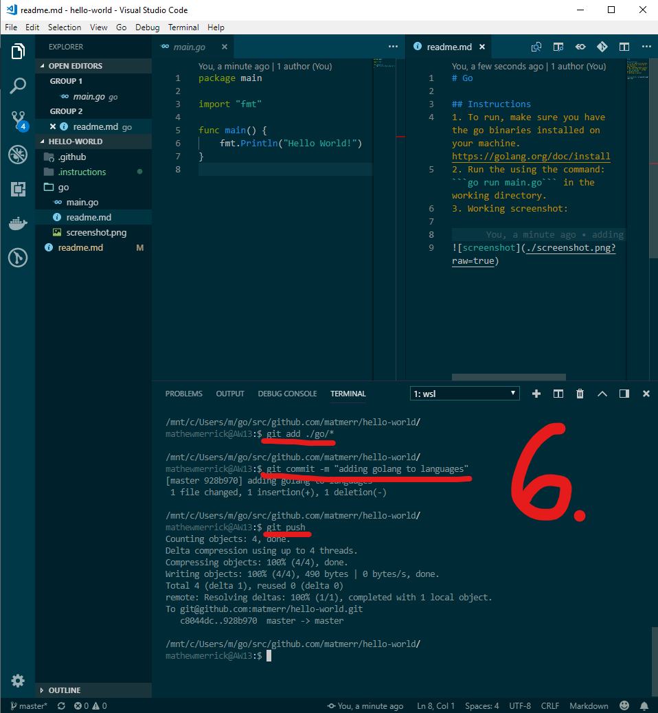
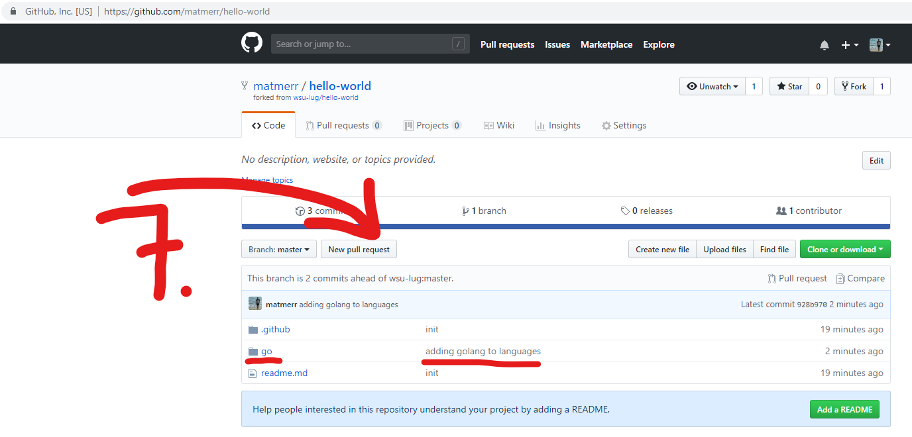
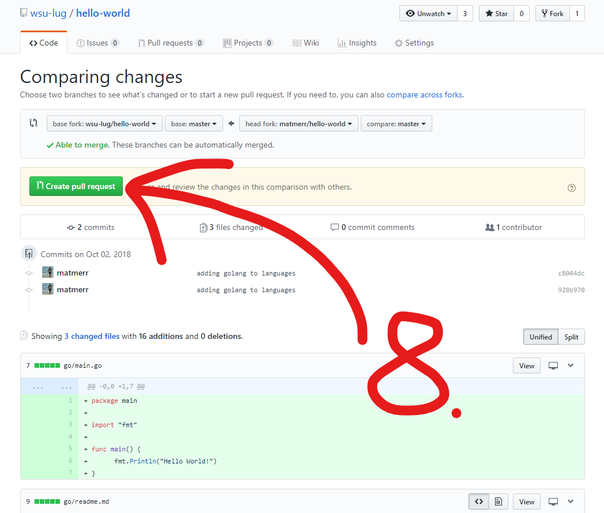

# Hello World

The purpose of this repository is to help people get familiar with creating pull requests, and to similarily recreate helloworldcollection.de.

For Hacktober 2018, we are encouraging students to open pull requests to add their favorite languages, and get started with opening pull requests. 

---

Prerequisites: 
- Have an account on github.com
- Have git installed in their local machine: [Instructions](https://git-scm.com/book/en/v2/Getting-Started-Installing-Git)

Steps: 

1. Make sure you're on this repository page.
2. Click "fork in the top right corner to fork this repository to your own account.



3. Once this repository has been forked to your own account, go to your profile to see the new forked repository.
4. Click on the ```Clone or Download``` button.If you installed [Github desktop](https://desktop.github.com/), you can clone that way. Otherwise, clone by either https or ssh by copying the respective command into your terminal.



5. Once you've cloned your forked repository to your local machine, open the folder in an editor of your choice. From here, create a new folder with the title of the language you're going to add. For example, we're adding Go, so we created a folder called "go". Inside this folder we have:

- All code required to run our hello world.
- A [Markdown](https://guides.github.com/features/mastering-markdown/) Readme file containing steps to run our hello world.
- A screenshot of the hello world running on our machine.



6. Now we we're going to use the terminal to add our files for staging, commit them with a commit message, and then push our code to the remote repository on github.com.



7. If we go back to the Github webpage showing our code, and refresh the page, we'll notice that our new folder is there, with everything we added. Now we can open a pull request. 



8. As soon as you click createpr, you'll be brought to a page which will describe all the changes you are wanting to make to the ```wsulug/hello-world``` repository. 



9. 