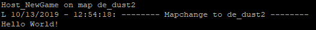

# SourcePawn

## What is SourcePawn, SourceMod and Metamod:Source?
SourcePawn is a scripting language based on Pawn. 

Pawn is an embeddable, (almost) typeless, easy to use scripting language that is compiled for a virtual machine written in C.

SourcePawn is used to create plugins for SourceMod. 

SourceMod is a plugin for Metamod:Source which is an API manager and interception handler that sits in between the source game engine and game modifications.

## Installation

- Download a game server that runs on the source engine and supports Metamod:source
- Download and install Metamod:source and SourceMod via https://wiki.alliedmods.net/Installing_SourceMod
- Compile the SourcePawn Script file using the compiler in the scripting folder (gamename/addons/sourcemod/scripting/) (example command: ./compile.sh hello.sp)
- Put the compiled file (hello.smx) in the plugins folder (gamename/addons/sourcemod/plugins/)
- Run the game server

